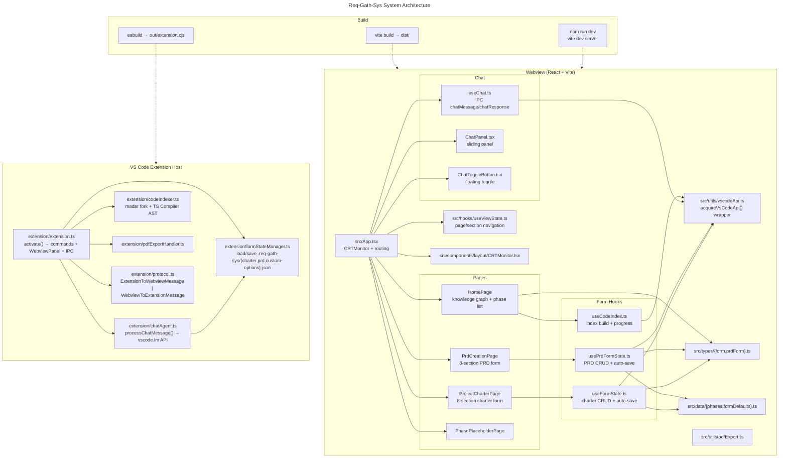
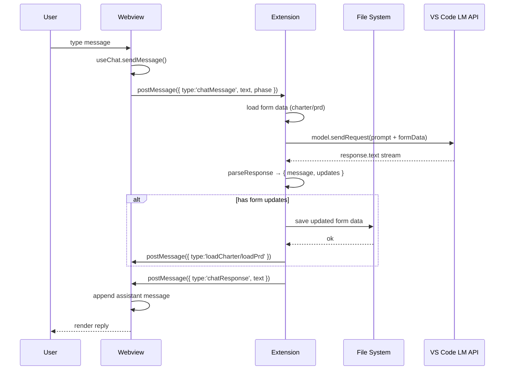
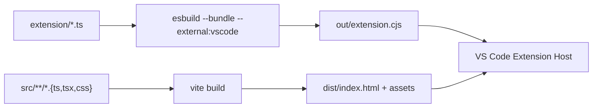

# Req-Gath-Sys Architecture

## Data Flow

## Build Pipeline

## Status

| Component | Status |
|-----------|--------|
| Extension IPC + form CRUD | ✅ |
| Webview routing + forms | ✅ |
| Chat UI (panel + toggle) | ✅ |
| Chat IPC (W→E → E→W) | ✅ |
| AI agent (chatAgent.ts) | ✅ calls VS Code LM API |
| Code indexer (madar + AST) | ✅ |
| PDF export | ✅ |
| **Form-filling via AI** | ❌ agent returns text, JSON parsing unreliable |
| Custom doc mode (BlockNote) | ❌ future |
| MCP tools | ❌ future |
