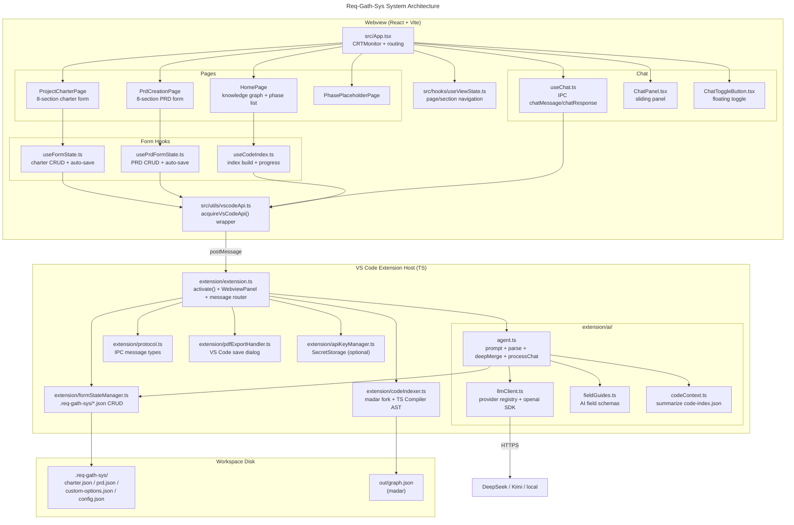
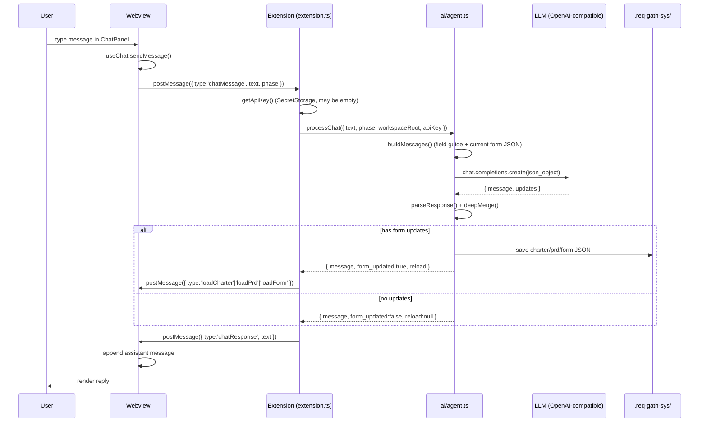
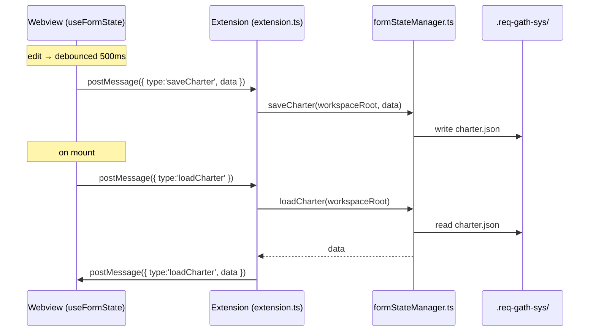

# Req-Gath-Sys Architecture

Req-Gath-Sys is a VS Code extension that guides teams through a 6-phase requirements pipeline
(Charter → PRD → System Design → Dev → QA → Post Dev). It is built in two layers:

1. **Webview (React + Vite)** — the UI: forms, pages, chat panel.
2. **TS extension host** — everything non-UI: form persistence, AI prompts, LLM calls, code indexer, PDF export.

The webview talks to the extension host via `postMessage`. The extension host runs entirely on Node
(the extension host's own runtime) — there is no separate backend process to spawn or bundle.
All AI work uses an OpenAI-compatible provider (DeepSeek by default, Kimi/local optional) — not Copilot.

## Data Flow (AI chat + form fill)

## Form CRUD Flow

## Extension message actions

Routed in `extension/extension.ts` (`handleMessage`):

| Message type | Purpose |
|--------------|---------|
| `initializeWorkspace` (command) | Create `.req-gath-sys/` + default `config.json` |
| `loadCharter` / `saveCharter` | Charter JSON CRUD |
| `loadPrd` / `savePrd` | PRD JSON CRUD (load also returns charter for context) |
| `loadForm` / `saveForm` | Generic per-phase JSON CRUD (e.g. system-design) |
| `loadCustomOptions` / `saveCustomOptions` | Editable dropdown options |
| `exportPdf` / `exportPdfAs` | Write PDF (webview renders the buffer with jsPDF) |
| `indexCodebase` / `loadCodeIndex` | Build / load the madar + AST code index |
| `chatMessage` | Full AI flow: build prompt → LLM → parse → merge → save |

IPC message types are camelCase (`loadCharter`). The extension host calls plain TS functions directly —
there is no cross-process protocol or serialization layer.

## LLM providers

Configured in `extension/ai/llmClient.ts` (`PROVIDERS` registry). All are OpenAI-compatible, so switching
is a one-line change per provider.

| Provider | base_url | Default model | API key env |
|----------|----------|---------------|-------------|
| `deepseek` (default) | `https://api.deepseek.com` | `deepseek-v4-flash` | `DEEPSEEK_API_KEY` |
| `kimi` | `https://api.moonshot.ai/v1` | `kimi-k2.6` | `MOONSHOT_API_KEY` |
| `local` | `http://localhost:11434/v1` | `llama3.2` | (none) |

- Active provider/model: `.req-gath-sys/config.json` → `{ "llm": { "provider": "deepseek", "model": null } }`.
- API key resolution order: SecretStorage (passed by the extension) → provider env var → generic `REQ_GATH_SYS_API_KEY` / `LLM_API_KEY`.

## Build Pipeline

| Command | What it does |
|---------|--------------|
| `npm run build` | Build extension bundle + webview |
| `npm run build:extension` | esbuild → `out/extension.cjs` (bundles `openai`) |
| `npm run build:webview` | vite → `dist/` |
| `npm run dev` | Vite dev server (webview only) |

## Layer ownership

| Concern | Layer | Notes |
|---------|-------|-------|
| Forms, pages, chat UI, validation display | Webview (`src/`) | React |
| IPC routing, VS Code APIs | Extension (`extension/`) | `extension.ts` stays a thin router |
| Form persistence, AI prompts, LLM calls, code index, PDF | Extension (`extension/`, `extension/ai/`) | Main logic |
| Build artifacts | `out/`, `dist/` | Never edit; rebuild |

## Status

| Component | Status |
|-----------|--------|
| Extension form CRUD (TS `formStateManager`) | Done |
| Webview routing + Charter/PRD forms | Done |
| Chat UI (panel + toggle) | Done |
| Chat flow (Webview → Extension → `ai/agent.ts`) | Done |
| AI orchestration (`extension/ai/`) | Done — OpenAI-compatible (DeepSeek/Kimi/local) |
| AI form-filling (JSON mode + dot-path merge) | Done |
| Code indexer (madar + AST) | Done |
| PDF export | Done |
| Code-index context in chat | Partial — reads `code-index.json` when present |
| System Design phase (Phase 3) | Scaffolded (form + AI + chat) |
| Dev/QA/Post-Dev phases | Placeholder |
| Custom doc mode (BlockNote) | Future |
| MCP tools | Future |
