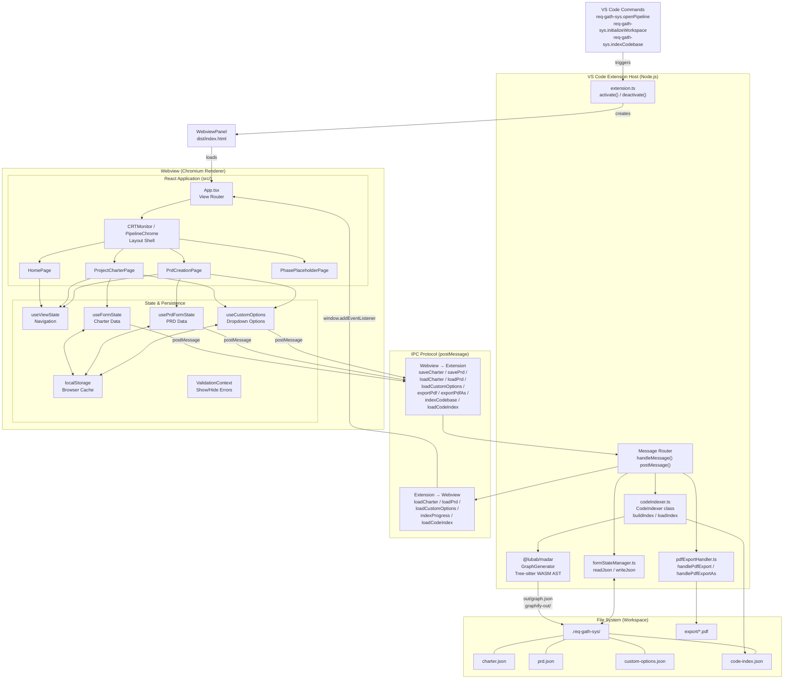
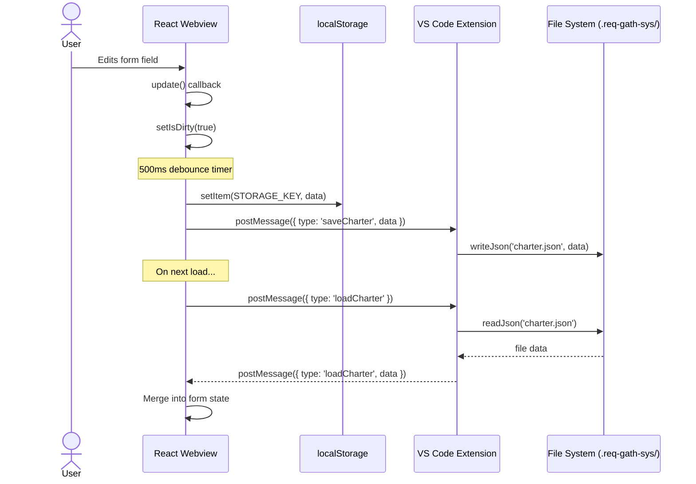
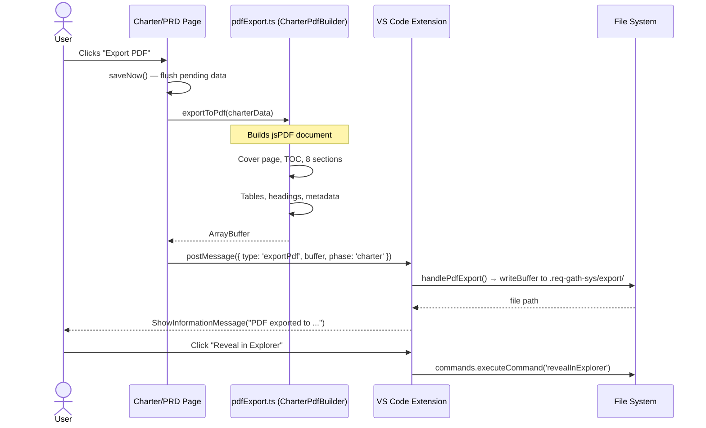
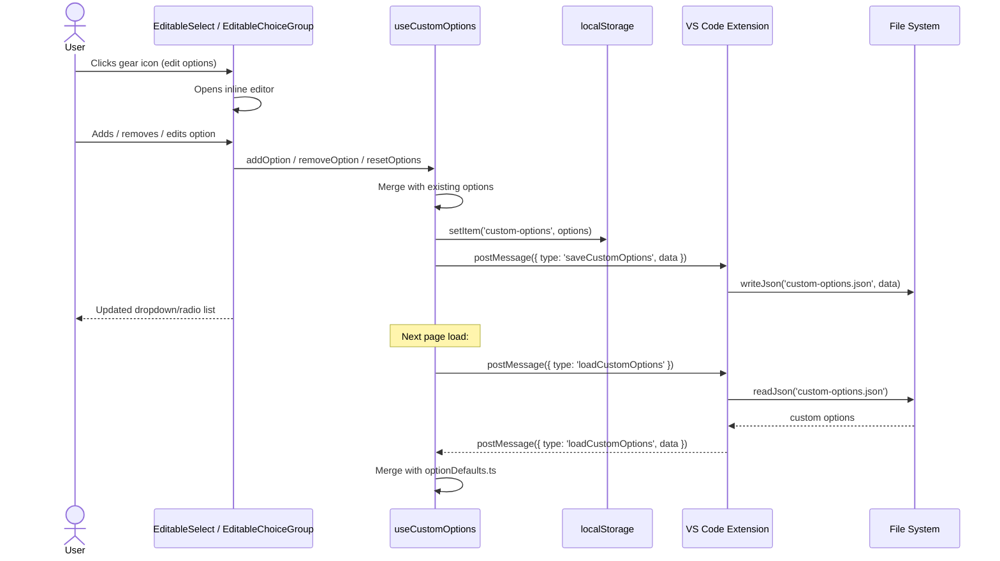
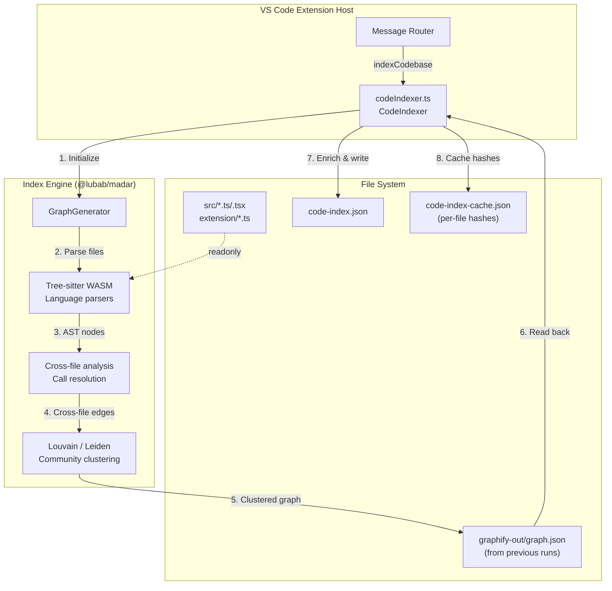
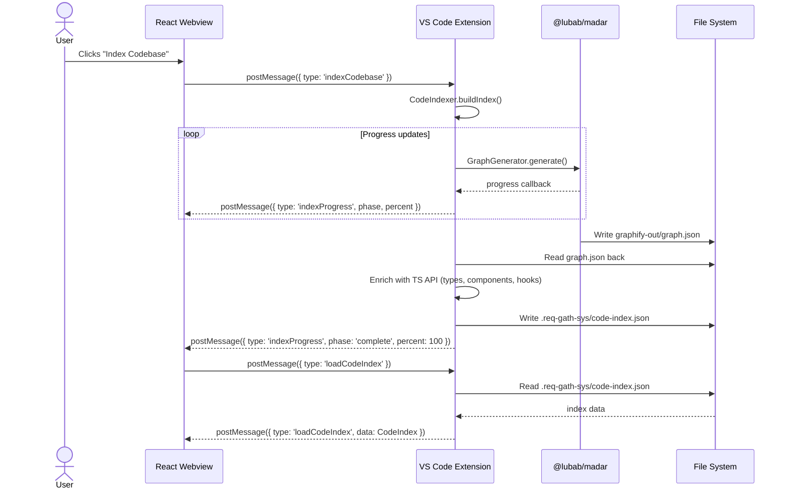

# Req-Gath-Sys — Architecture

Req-Gath-Sys is a **VS Code extension** that serves a **React single-page application** within a webview panel. It provides a structured 6-phase pipeline for AI project requirements gathering, with gate-based phase progression and file-system persistence. There is no traditional backend or database — all state lives in the webview (localStorage) and is mirrored to JSON files on disk.

---

## Harness Diagram — System Architecture

The diagram below shows the system-level integration harness: how the VS Code extension host, the webview React application, the file system, and the IPC protocol interconnect.



**Key integration points:**
- **Extension → Webview**: Extension serves the built `dist/index.html` via `webview.html`, rewrites asset paths for `file://` protocol, and injects a Content Security Policy.
- **Webview → Extension**: All persistent operations (save, load, export) are sent as typed JSON messages via `vscode.postMessage()`. The extension routes messages to `formStateManager`, `pdfExportHandler`, or `codeIndexer`.
- **Persistence**: The webview writes to `localStorage` immediately (for speed) and sends the same data to the extension, which writes it to `.req-gath-sys/*.json` (for durability across sessions).
- **Code Indexing**: The extension host imports `@lubab/madar` (tree-sitter WASM) in-process — no Python, no subprocess. Indexed code structure is written to `.req-gath-sys/code-index.json` and queried via the same IPC pattern.

---

## Component & State Architecture

This diagram shows the React component hierarchy, state hook usage, and data flow between them.

```mermaid
graph TB
    subgraph "React Component Tree"
        CRT["CRTMonitor<br/>(CRT overlay wrapper)"]
        PC["PipelineChrome<br/>(Global Header + Footer)"]
        APP["App.tsx"]

        subgraph "Pages"
            HP["HomePage"]
            CP["ProjectCharterPage"]
            PP["PrdCreationPage"]
            PLP["PhasePlaceholderPage"]
        end

        subgraph "Charter Sections (Section1-8)"
            S1["Section1<br/>Project Identity"]
            S2["Section2<br/>Problem Statement"]
            S3["Section3<br/>Success Metrics"]
            S4["Section4<br/>Stakeholder Alignment"]
            S5["Section5<br/>AI Requirements"]
            S6["Section6<br/>Project Context"]
            S7["Section7<br/>Constraints & Risks"]
            S8["Section8<br/>Gate Review"]
        end

        subgraph "PRD Sections (PrdSection1-8)"
            PS1["PrdSection1<br/>Executive Summary"]
            PS2["PrdSection2<br/>Goals & Scope"]
            PS3["PrdSection3<br/>User Personas"]
            PS4["PrdSection4<br/>Functional Req"]
            PS5["PrdSection5<br/>Non-Functional Req"]
            PS6["PrdSection6<br/>Data & AI Req"]
            PS7["PrdSection7<br/>Rollout & Integrations"]
            PS8["PrdSection8<br/>Review & Sign-off"]
        end

        subgraph "Shared Components"
            FF["FormFields<br/>TextField / RadioGroup /<br/>CheckboxGroup / DynamicTable<br/>SelectField / GateChecklist"]
            ES["EditableSelect<br/>Customizable Dropdown"]
            ECG["EditableChoiceGroup<br/>Customizable Radio Group"]
            ART["AutoResizeTextarea"]
        end

        subgraph "Sidebar / Nav"
            PO["PhaseOverview<br/>Charter Dashboard"]
            PSS["PhaseSidebar<br/>Section Nav"]
            PRDO["PrdOverview<br/>PRD Dashboard"]
            PRSS["PrdSidebar<br/>Section Nav"]
        end
    end

    subgraph "State Management"
        UVS["useViewState<br/>view: {page, section}"]
        UFS["useFormState<br/>charter FormData"]
        UPFS["usePrdFormState<br/>prd PrdFormData"]
        UCO["useCustomOptions<br/>stringOptions / choiceOptions"]
        VALC["ValidationContext<br/>showValidation: bool"]
    end

    APP --> CRT
    APP --> UVS
    CRT --> PC
    CRT --> HP & CP & PP & PLP

    HP --> UVS
    CP --> UVS & UFS & VALC
    PP --> UVS & UPFS & VALC

    CP --> PO & PSS
    PO & PSS --> UFS
    CP --> S1 & S2 & S3 & S4 & S5 & S6 & S7 & S8

    PP --> PRDO & PRSS
    PRDO & PRSS --> UPFS
    PP --> PS1 & PS2 & PS3 & PS4 & PS5 & PS6 & PS7 & PS8

    S1 & S2 & S3 & S4 & S5 & S6 & S7 & S8 --> FF & ES & ECG & ART
    PS1 & PS2 & PS3 & PS4 & PS5 & PS6 & PS7 & PS8 --> FF & ES & ECG & ART

    ES & ECG --> UCO
    S8 --> VALC
    PS8 --> VALC
```



**State ownership rules:**
- `useViewState` — holds the current page and section; the single source of truth for routing.
- `useFormState` — owns `FormData` (charter); auto-saves with 500ms debounce to both `localStorage` and the extension.
- `usePrdFormState` — owns `PrdFormData` (PRD); same auto-save pattern; also loads charter data for cross-reference.
- `useCustomOptions` — owns editable dropdown/choice customizations; shared across all sections.
- `ValidationContext` — a boolean toggle (show/hide validation markers) set by gate review sections.

---

## Pipeline Phase Flow

The 6-phase pipeline with gate-based progression. Phases 1–2 are fully implemented; 3–6 are placeholders.

```mermaid
stateDiagram-v2
    [*] --> Home

    state "Phase 1: Project Charter" as P1 {
        [*] --> Overview
        Overview --> Section1
        Section1 --> Section2
        Section2 --> Section3
        Section3 --> Section4
        Section4 --> Section5
        Section5 --> Section6
        Section6 --> Section7
        Section7 --> Section8_GateReview
        Section8_GateReview --> Approved
        Section8_GateReview --> Revision
        Revision --> Section8_GateReview
    }

    state "Phase 2: PRD Creation" as P2 {
        [*] --> PrdOverview
        PrdOverview --> PrdSection1
        PrdSection1 --> PrdSection2
        PrdSection2 --> PrdSection3
        PrdSection3 --> PrdSection4
        PrdSection4 --> PrdSection5
        PrdSection5 --> PrdSection6
        PrdSection6 --> PrdSection7
        PrdSection7 --> PrdSection8_Review
        PrdSection8_Review --> PrdApproved
        PrdSection8_Review --> PrdRevision
        PrdRevision --> PrdSection8_Review
    }

    state "Phase 3: System Design" as P3 {
        [*] --> P3_ComingSoon
    }

    state "Phase 4: Development" as P4 {
        [*] --> P4_ComingSoon
    }

    state "Phase 5: QA" as P5 {
        [*] --> P5_ComingSoon
    }

    state "Phase 6: Post Dev" as P6 {
        [*] --> P6_ComingSoon
    }

    Home --> P1: Launch Pipeline
    Approved --> P2: Proceed to PRD
    PrdApproved --> P3: Proceed to Design
    P3 --> P4
    P4 --> P5
    P5 --> P6
    P6 --> [*]: Handover Complete
```



**Gate review flow (Section 8):**

```
Sections 1-7 Complete?
    ├── No → Gate locked, cannot access Section 8
    └── Yes → Gate unlocked
                ├── Gate Decision: Approved → Phase complete, unlock next phase
                ├── Gate Decision: Revision → Fix issues, resubmit
                └── Gate Decision: Rejected → Phase failed, return to start
```

---

## Key Workflow Diagrams

### 1. Data Persistence Flow



### 2. PDF Export Flow



### 3. Custom Options (Editable Dropdown) Flow



---

## Code Indexing Architecture

The code indexing layer builds a structured, queryable map of the entire workspace codebase. It runs **in-process** inside the VS Code extension host — no Python, no subprocesses, no API keys.

### Indexing Pipeline



### Index IPC Flow

The webview triggers indexing and reads the result through the same message-based IPC pattern used for charter/PRD data:



### Index Structure (`.req-gath-sys/code-index.json`)

```jsonc
{
  "version": 1,
  "generatedAt": "2026-06-08T12:00:00.000Z",
  "summary": {
    "totalFiles": 48,
    "totalTypes": 24,
    "totalComponents": 12,
    "totalHooks": 4,
    "totalIpcMessages": 15
  },
  "files": [
    {
      "path": "src/App.tsx",
      "kind": "react-component",
      "exports": ["App"],
      "imports": [
        { "source": "./components/layout/CRTMonitor", "names": ["CRTMonitor"] }
      ],
      "components": [{ "name": "App", "propsInterface": null }],
      "hooks": ["useViewState"],
      "hasJsdoc": false,
      "loc": 85
    }
  ],
  "types": [
    {
      "name": "FormData",
      "source": "src/types/form.ts",
      "kind": "interface",
      "properties": [
        { "name": "section1", "type": "Section1Data", "optional": false },
        { "name": "section2", "type": "Section2Data", "optional": false }
      ]
    }
  ],
  "components": [
    {
      "name": "CRTMonitor",
      "file": "src/components/layout/CRTMonitor.tsx",
      "propsInterface": null,
      "parentComponents": ["App"],
      "childComponents": ["PipelineChrome"]
    }
  ],
  "ipc": {
    "webviewToExtension": [
      { "type": "saveCharter", "payload": "unknown" },
      { "type": "indexCodebase", "payload": "never" }
    ],
    "extensionToWebview": [
      { "type": "loadCharter", "payload": "unknown" },
      { "type": "indexProgress", "payload": "{ phase: string, percent: number }" }
    ]
  },
  "graph": {
    "nodes": 91,
    "edges": 41,
    "communities": [
      { "id": 0, "name": "Build & Lint Tooling", "cohesion": 0.25, "nodeCount": 8 },
      { "id": 2, "name": "TypeScript Configuration", "cohesion": 0.38, "nodeCount": 7 }
    ]
  },
  "cache": {
    "byFile": {
      "src/App.tsx": "sha256-hash",
      "extension/extension.ts": "sha256-hash"
    }
  }
}
```

### Incremental Rebuild

The indexer caches per-file hashes in `.req-gath-sys/code-index-cache.json`. On subsequent runs, only files whose hash changed are re-parsed. This keeps rebuilds fast (~2–5s for small changes vs ~30s for a full index).

### New IPC Messages

| Direction | Type | Payload | Description |
|---|---|---|---|
| W→E | `indexCodebase` | — | Trigger a full or incremental index rebuild |
| W→E | `loadCodeIndex` | — | Request the current cached index |
| E→W | `indexProgress` | `{ phase: string, percent: number }` | Real-time progress during indexing |
| E→W | `loadCodeIndex` | `CodeIndex \| null` | Returns the current index |

### Caching Rules (`.req-gath-sys/`)

```
.req-gath-sys/
├── charter.json                # ← existing
├── prd.json                    # ← existing
├── custom-options.json         # ← existing
├── code-index.json             # ← new (full index)
├── code-index-cache.json       # ← new (per-file hashes for incremental)
└── export/                     # ← existing
```

## Data Model

### Charter Data (`FormData` — `src/types/form.ts`)

| Section | Key | Fields |
|---|---|---|
| 1 — Project Identity | `section1` | projectName, projectCode, dateSubmitted, submittedBy, aiTeamLead, targetStartDate, requestedDeliveryDate, projectType, priority, priorityJustification, budgetEstimate, teamSkillsRequired, sponsorDecisionMaker, keyMilestones, includesAiWork |
| 2 — Problem Statement | `section2` | coreProblem, whoAffected, currentWorkaround, costOfInaction, primaryObjective, secondaryObjectives, nonGoals |
| 3 — Success Metrics | `section3` | primaryKpi, targetValue, measurementMethod, performanceMetrics[], acceptanceCriterion1-3, definitionOfDone{6 booleans} |
| 4 — Stakeholder Alignment | `section4` | stakeholders[], elicitationSummary, assumptions[], artifactLinks |
| 5 — AI Requirements | `section5` | dataRequired, dataOwnerAccess, dataCurrentState, dataVolume, dataReadiness{6 booleans}, dataSensitivity, aiWorkTypes{10 booleans}, aiWorkOther, techStackConstraints, deploymentTarget, latencyRequirement, throughputRequirement, costPerCall, uptimeSla, infrastructureConstraints, acceptableErrorRate, whenModelWrong, whenUnavailable, biasFairness |
| 6a — Client Services | `section6A` | clientName, clientPoc, contractScope, writtenConfirmation, deliverableFormat, clientApprover, infrastructureDependencies, commercialConstraints, dependencies, artifactLinks |
| 6b — Internal Product | `section6B` | productArea, roadmapStatus, internalStakeholder, userResearchEvidence, appetite, dependencies, artifactLinks |
| 7 — Constraints & Risks | `section7` | timeConstraints, resourceConstraints, technologyConstraints, budgetConstraints, risks[], openQuestions[] |
| 8 — Gate Review | `section8` | definitionOfReady{}, gateDecision, gateReviewNotes, signatures[] |

### PRD Data (`PrdFormData` — `src/types/prdForm.ts`)

| Section | Key | Fields |
|---|---|---|
| 1 — Executive Summary | `section1` | solutionOverview, scopeItems[], keyDecisions[] |
| 2 — Goals & Scope | `section2` | businessGoals[], successMetrics[], outOfScope[] |
| 3 — User Personas | `section3` | personas[] |
| 4 — Functional Req | `section4` | features[] |
| 5 — Non-Functional Req | `section5` | performance/security/scalability/compliance/usabilityRequirements[] |
| 6 — Data & AI Req | `section6` | dataSources[], dataSchemaFormat, dataVolumeEstimate, dataAccessRequirements[], aiModelSelectionCriteria, aiEvalCriteria, aiFallbackBehavior, aiLabelingAnnotationNeeds, aiBiasFairness |
| 7 — Rollout & Integrations | `section7` | integrationPoints[], thirdPartyDependencies[], releaseStrategy, keyMilestones[], rollbackPlan, risks[], openQuestions[] |
| 8 — Review & Sign-off | `section8` | prdStatus, reviewNotes, signatures[] |

### Shared Row Types

| Type | Fields |
|---|---|
| `PerformanceMetricRow` | metric, minimumThreshold, target, measurementMethod |
| `StakeholderRow` | nameRole, interestLevel(H/M/L), influence(H/M/L), keyConcern |
| `AssumptionRow` | assumption, classification(KNOWN/UNKNOWN/RISKY), ifWrongImpact |
| `RiskRow` | risk, likelihood(H/M/L), impact(H/M/L), mitigation |
| `OpenQuestionRow` | question, owner, dueDate, status |
| `SignatureRow` | name, role, signature, date |
| `PersonaRow` | persona, description, goals, painPoints |
| `FeatureRow` | epic, userStory, priority(H/M/L), acceptanceCriteria, notes |
| `ScopeItemRow` | item, description, priority(H/M/L) |
| `NfrRow` | requirement, specification |
| `DataSourceRow` | source, type, volume, accessMethod |
| `IntegrationRow` | system, integrationType, protocol |
| `DependencyRow` | dependency, version, notes |
| `MilestoneRow` | milestone, date, owner |

### File Storage

All files live under `.req-gath-sys/` in the workspace root (git-ignored):

```
.req-gath-sys/
├── charter.json                # FormData (charter)
├── prd.json                    # PrdFormData (PRD)
├── custom-options.json         # Editable dropdown/choice overrides
├── code-index.json             # Codebase index (AST, types, components, graph)
├── code-index-cache.json       # Per-file hashes for incremental rebuild
└── export/                     # Exported PDF files
```

---

## Project File Map

```
Req-Gath-Sys/
├── extension/                        # VS Code extension (Node.js host)
│   ├── extension.ts                  # Entry: activate, register commands, IPC router
│   ├── protocol.ts                   # Types for webview ⟷ extension messages
│   ├── formStateManager.ts           # Read/write JSON files in .req-gath-sys/
│   ├── codeIndexer.ts                # Codebase indexer (madar + TS API)
│   └── pdfExportHandler.ts           # Write PDF buffers to disk
│
├── src/                              # React webview application
│   ├── main.tsx                      # React DOM entry
│   ├── App.tsx                       # Root: CRTMonitor + view router
│   ├── App.css                       # Mac OS 9 theme (1007 lines)
│   ├── index.css                     # Tailwind v4 + CRT overlay
│   │
│   ├── types/                        # TypeScript interfaces
│   │   ├── form.ts                   #   Charter FormData & row types
│   │   └── prdForm.ts                #   PRD PrdFormData & row types
│   │
│   ├── data/                         # Defaults & config
│   │   ├── formDefaults.ts           #   Charter initial values + section labels
│   │   ├── prdFormDefaults.ts        #   PRD initial values
│   │   ├── phases.ts                 #   6-phase pipeline definition
│   │   └── optionDefaults.ts         #   Default dropdown/select options
│   │
│   ├── hooks/                        # State management
│   │   ├── useViewState.ts           #   Navigation (page + section)
│   │   ├── useFormState.ts           #   Charter form data + auto-save
│   │   ├── usePrdFormState.ts        #   PRD form data + auto-save
│   │   └── useCustomOptions.ts       #   Editable dropdown options
│   │
│   ├── context/
│   │   └── ValidationContext.tsx      # Show/hide validation markers
│   │
│   ├── utils/
│   │   ├── vscodeApi.ts              # acquireVsCodeApi() wrapper
│   │   ├── validation.ts             # Charter section validation logic
│   │   ├── prdValidation.ts          # PRD section validation logic
│   │   └── pdfExport.ts              # jsPDF-based CharterPdfBuilder (695 lines)
│   │
│   ├── pages/
│   │   ├── HomePage.tsx              # Pipeline dashboard with 6 phase tiles
│   │   ├── ProjectCharterPage.tsx     # Phase 1: Charter with sidebar + 8 sections
│   │   ├── PrdCreationPage.tsx        # Phase 2: PRD with sidebar + 8 sections
│   │   └── PhasePlaceholderPage.tsx   # Phases 3-6 placeholder
│   │
│   └── components/
│       ├── layout/
│       │   ├── CRTMonitor.tsx         # CRT scanline/glow overlay
│       │   └── PipelineChrome.tsx     # Global header + footer
│       ├── FormFields.tsx             # Reusable form controls
│       ├── EditableSelect.tsx         # Customizable dropdown
│       ├── EditableChoiceGroup.tsx    # Customizable radio group
│       ├── AutoResizeTextarea.tsx     # Auto-growing textarea
│       ├── project-charter/
│       │   ├── PhaseOverview.tsx      # Charter dashboard
│       │   └── PhaseSidebar.tsx       # Charter section nav
│       ├── sections/
│       │   ├── Section1-3.tsx         # Charter sections 1-3
│       │   └── Section4-8.tsx         # Charter sections 4-8
│       └── prd-sections/
│           ├── PrdOverview.tsx        # PRD dashboard
│           ├── PrdSidebar.tsx         # PRD section nav
│           ├── PrdSection1-4.tsx      # PRD sections 1-4
│           └── PrdSection5-8.tsx      # PRD sections 5-8
│
├── dist/                              # Vite build output (served by webview)
│   └── assets/
│       └── index.js, style.css, ...
│
├── out/                               # esbuild output (extension.cjs)
├── public/                            # Static assets (favicon, icons)
├── package.json                       # Extension + webapp manifest
├── vite.config.ts                     # Vite bundler config
├── tsconfig*.json                     # TypeScript configs
└── eslint.config.js                   # ESLint flat config
```

---

## Technology Stack

| Layer | Technology | Role |
|---|---|---|
| Extension host | VS Code API ^1.96, esbuild | Webview creation, file I/O, command registration |
| UI framework | React 19 + TypeScript 6 | Component rendering, state management |
| Bundler | Vite 8 + @vitejs/plugin-react | Build webview assets |
| Styling | Tailwind CSS 4 + custom CSS (Mac OS 9) | Utility classes + retro theme |
| PDF | jsPDF 4 + jspdf-autotable 5 | Client-side PDF generation |
| Persistence | localStorage + JSON files (via VS Code fs) | Dual-layer state persistence |
| Code index | @lubab/madar (tree-sitter WASM) | AST extraction, community clustering |
| Fonts | Material Symbols, Public Sans, JetBrains Mono | Icons, headings, code labels |

---

## Notable Architectural Decisions

1. **No backend, no database.** The entire application runs inside VS Code. Data is stored as JSON files in a `.req-gath-sys/` workspace directory — no Express, no SQL, no network calls.

2. **Dual persistence.** The webview writes to `localStorage` immediately (for UI responsiveness) and sends the same data to the extension via IPC, which writes to disk (for durability across dev sessions). On load, data is read from disk and merged into the webview state.

3. **No router library.** View routing uses a simple `useViewState` hook with a discriminated union type (`{ page, section }`). No React Router, no URL-based routing — the webview is a single standalone panel.

4. **Gate-based progression.** Each phase gates progression on a formal review step (Section 8 / Gate Review). The Definition of Ready checklist must be completed and a gate decision (approved/revision/rejected) must be recorded before the next phase unlocks.

5. **Editable dropdowns as a UX primitive.** Every select and radio group allows users to add, edit, or remove options at runtime. Customizations persist across sessions via the same dual-layer storage mechanism.

6. **CRT / Mac OS 9 theme.** The UI intentionally mimics vintage Mac OS 9 aesthetics — system font stack, beveled in/out borders, striped title bars, dither patterns, and a CRT scanline overlay — giving the tool a distinctive retro-futuristic identity.

7. **In-process code indexing via tree-sitter WASM.** The `codeIndexer.ts` module imports `@lubab/madar` (a pure TypeScript code analyzer using tree-sitter WebAssembly) to extract AST, cross-file relationships, and community clusters — all in the same Node.js process as the extension. No Python, no subprocess, no API keys. The result is cached to `.req-gath-sys/code-index.json` for downstream consumers (documentation AI, impact analysis, search).
